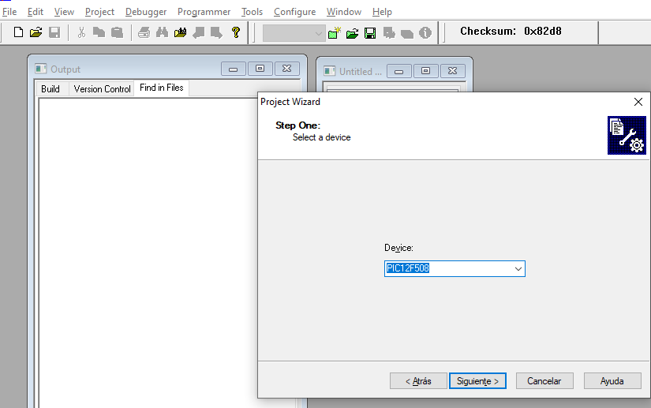
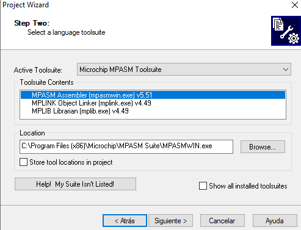
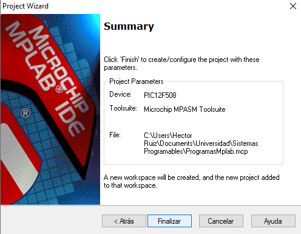
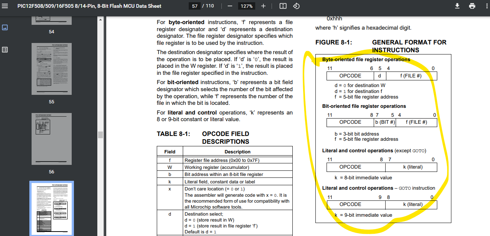

# Notas
Aqui se encuentran las fechas en las cuales se fue abordando contenido en la materia

## 09/02/2023
La clase debería llmarse sistemas de bajo costo 

Rubrica | Ponderación
--- | ---
Proyecto (en equipo ) | 60%
Tareas (individual) </br> - Cuestionarios </br>- Investigaciones</br>-etc.  | 40%

Hay puntos extra

La clase de hoy empieza hablando del siguiente programa: 

```
AC <- AC + M[X] ; x = dirección M[x] = contenido de la dir x

;Familia PIC
W <- W + F[FFFFF]; si d = 0

F[FFFFF] <- W + F[FFFFF]; si d =1
```

Para ello iremos a mplab 

1. Vamos en el project y escogemos el wizart y ahí escogemos el Device: **PIC12F508**  
   
2. 
3. 
4. 

5. Ahora se habla del tipo de programa que estaremos utilizando en este microchip 


``` assamble
;PROGRAMA PARA SUMAR 5 MAS0 2
LIST P=12F508
;hay que poner mireg para un nombre de registro que queramos
;tambien podemo poner la dirección en cualquier nombenclatura que queramos 
MIREG equ 0x07

;ahora le decimos en qué lugar debemos de poner el programa 

org 0x0;en este caso ponemos un origen

;en uno de los registros hay que poner el 5 y el 2

;movlw 0x02 ;W<-0x2 ;si ponemos el dos primero cuando queramos subir el otro ese valor no desaparecera

movlw 0x05 ;de esta manera eliminamos el acomulador y esto hace que perdamoe el numero dos 
;ahora la línea de abajo es mi regisro de carga con el acomulador 
movwf MIREG;F[MIREG]] <- W

movlw 0x02 ;w<- 0x02

;después de estos movimientos puedo hacer la suma 

addwf MIREG, 0 ; W< W+F[MIREG] si es un bit cero es a la memoria pero si es un uno suma al acomulador 

end

```

Nota: 
la memoria de este procesador tiene una memoria capacitiva es decir tiene una tarea que se repetira infinitamente ya que esta no cuenta con **Sistema operativo**. 

## 13/02/2023

El día de hoy compararemos códigos 

````
; EJEMPLO 01
	LIST		P=12F508		;Tipo de procesador
    ;
	INCLUDE	"P12F508.INC"	;Definición registros internos
	IMPAR		EQU	0x09		;Def. de par etiqueta valor
		ORG		0x00		;Inicio programa
        ;aquí crga el acomulador con una constante
		MOVLW		b'00000001';Mueve 1 a la posición IMPAR
        ;
		MOVWF		IMPAR
		MOVLW		b'00000010';Mueve 2 a WREG
BUCLE:	ADDWF		IMPAR,1	;IMPAR + W = IMPAR
;Si onemos incf W,0 entonces el include como dice w esun bit cero entonces tenemos un error. y la cero es una dirección 
		NOP				;No hace nada
		GOTO		BUCLE		;Repite el bucle
	
		END				;Fin pograma

````

estamos observano el microchip el cual se encuentra en programas 86 segudo de microchip. 

## 27/02/2023


El día d ehoy veremos **MODOS DE DIRECCIONAMIENTO DE 16F846A**

Recordatorio de arquitectura de computadoras

Veremos el **Directo e Indirecto**

Debemos de bajar el archivo de la plataforma

Vemos el primer banco que el **pic16f84A**

- Direccionamiento directo es el recibe el código de instrucción y en esa parte estarán los bit F y la dirección que está en el código de inestrucción será la que esetará directamente en el Banco o Stack 

  - Nota en program memori podems ver el archivo en binario
- si el opcode es **0086** la dirección directa es **6** ya que el **8** es F de ruta

- direcionamiento **inmediato** lo que se está operando es lo que está allá es decir la direección pasa a ser un número o sea no la ruta a la que se refeerencia esta trabajndo inmediatamente y en el estack está el operando.
- **indirecto** aquí yo tengo la memoria en la cual tengo una dirección hasta arribal como ejemplo entonces lo que sucede llama a una parte del stack y el poperando no está en esa parte del estack si no en otro lugar este modo permite por ejemplo que en ppython una variable le aasignas una variable entera y después le pones una cadena y entonces lo que sucede es que esta en modo relativo y por eso puede cambiar el tipo de dato.

```
LIST P16F84A
INCLUDE <16f84a.INC>
CUENTA EQU 0X20
SUMA EQU  0X21

ORG 0

baf STATUS, RPO ; CAMBIAR EL BANCO 1
movlw b'00000000' ; w<- 0x00
movwf TRISB ; TRISB <-w
bcf STAUS, RPO ; regresar al banco 0

inicio 
	clrf SUMA ; F [Suma] <-- 0x00
	movlw 0x0A ; w <-- 0x0A
	movwf CUENTA ; F[CUENTA] <- w
ciclo
	addwf SUMA 1 ; SUMA <- FSUMA +w
	decfaz CUENTA, 1 ;
	movfw CUENTA ; w<fcuenta
	goto ciclo
	movfw SUMA ; w<--fsuma

salida
	movfw SUMA ; w<--FSUMA
	goto salida

end

```

## 02/03/2023

El dia de hoy se corrigo el direccionamiento indirecto 

LIST p=16F84A
;usaremos un registro intermediario 
; el intermediario es FSR
INCLUDE <P16F84A.INC>

org 0
movlw 0x0c
movwf FSR

ciclo 
	incf FSR; que no lo tome ocn contenido si no como dirección
	clrf INDF; cuando quiera borar el cero entonces 
	btfss INDF,1  
	comf FSR, 3
	goto ciclo 
end

cuando vamos al as variabled indf es un indirecto lo que se haees incrementar o borrar el int f 


**CBLOCK**
**ENDC**
 

 cada que yo ponbo bano 0 entonces le eaeta cmaibnaod el nombre a las instrucciónes y pue al profe no le gusta 


## 06/03/2023

### Salto indexado
**Ejemplo del salto**
```

;********************************** Indexado_01.asm *************************************
;
;	===================================================================
;	  Del libro "MICROCONTROLADOR PIC16F84. DESARROLLO DE PROYECTOS"
;	  E. Palacios, F. Remiro y L. López.
; 	  Editorial Ra-Ma.  www.ra-ma.es
;	===================================================================
;
; Implementar una tabla de la verdad mediante el manejo de tablas grabadas en ROM.
; Por ejemplo, la tabla será de 3 entradas y 6 salidas tal como la siguiente:
; 
; 		C  B  A  | S5  S4  S3  S2  S1  S0
; 		-----------|---------------------------
; 		0   0   0   |   0    0    1    0    1    0	; (Configuración 0).
; 		0   0   1   |   0    0    1    0    0    1	; (Configuración 1).
; 		0   1   0   |   1    0    0    0    1    1	; (Configuración 2).
; 		0   1   1   |   0    0    1    1    1    1	; (Configuración 3).
; 		1   0   0   |   1    0    0    0    0    0	; (Configuración 4).
; 		1   0   1   |   0    0    0    1    1    1	; (Configuración 5).
; 		1   1   0   |   0    1    0    1    1    1	; (Configuración 6).
; 		1   1   1   |   1    1    1    1    1    1	; (Configuración 7).
;
; Las entradas C, B, A se conectarán a las líneas del puerto A: RA2 (C), RA1 (B) y RA0 (A).
; Las salidas se obtienen en el puerto B:
; RB5 (S5), RB4 (S4), RB3 (S3), RB2 (S2), RB1 (S1) y RB0 (S0).
;
; ZONA DE DATOS **********************************************************************

	__CONFIG   _CP_OFF &  _WDT_OFF & _PWRTE_ON & _XT_OSC
	LIST	   P=16F84A
	INCLUDE  <P16F84A.INC>

; ZONA DE CÓDIGOS ********************************************************************

	ORG 	0			; El programa comienza en la dirección 0.
Inicio
	bsf	STATUS,RP0		; Acceso al Banco 1.
	clrf	TRISB			; Las líneas del Puerto B se configuran como salida.
	movlw	b'00011111'		; Las 5 líneas del Puerto A se configuran como entrada.
	movwf	TRISA
	bcf	STATUS,RP0		; Acceso al Banco 0.
Principal
	movf	PORTA,W		; Lee el valor de las variables de entrada.
	andlw	b'00000111'		; Se queda con los tres bits de entrada.
	addwf	PCL,F			; Salta a la configuración adecuada.
Tabla
	goto	Configuracion0
	goto	Configuracion1
	goto	Configuracion2
	goto	Configuracion3
	goto	Configuracion4
	goto	Configuracion5
	goto	Configuracion6
	goto	Configuracion7
Configuracion0
	movlw 	b'00001010'		; (Configuración 0).
	goto	ActivaSalida
Configuracion1
	movlw 	b'00001001'		; (Configuración 1).
	goto	ActivaSalida
Configuracion2
	movlw 	b'00100011'		; (Configuración 2).
	goto	ActivaSalida
Configuracion3
	movlw 	b'00001111'		; (Configuración 3).
	goto	ActivaSalida
Configuracion4
	movlw 	b'00100000'		; (Configuración 4).
	goto	ActivaSalida
Configuracion5
	movlw 	b'00000111'		; (Configuración 5).
	goto	ActivaSalida
Configuracion6
	movlw 	b'00010111'		; (Configuración 6).
	goto	ActivaSalida
Configuracion7
	movlw 	b'00111111'		; (Configuración 7).
ActivaSalida
	movwf	PORTB			; Visualiza por el puerto de salida.
	goto 	Principal

	END
	
;	===================================================================
;	  Del libro "MICROCONTROLADOR PIC16F84. DESARROLLO DE PROYECTOS"
;	  E. Palacios, F. Remiro y L. López.
; 	  Editorial Ra-Ma.  www.ra-ma.es
;	===================================================================
```

aquí si podemos modificar el **PC**, 

### Salto indexao descontrolado


## 16/03/2023


Se ponen los resultados en tablas, en vez de que yo caucle en see momento con unaa formula matemática entonces lo que hagoes deslozarlo a pasos. 

la unidad de punto flontante calcula seno, conseno, algoritmos complejos y asi.

- Existe una instrucción **"retlw"**
  - La instrucción return wth literal in W funcina de form asimilar a que return, procude el retorno de una subrutina pero con hun valor en el registro W. Dicha características es de sua importancia cuando se desea acceder a tablas de datos en la memoria de programa 
  - el formato de esta instrucción es: 
  - *rethw k*
  - donde k es un valor es la ocnstante que se carga en la tabla  y se devuelve enla tabla.
  - 